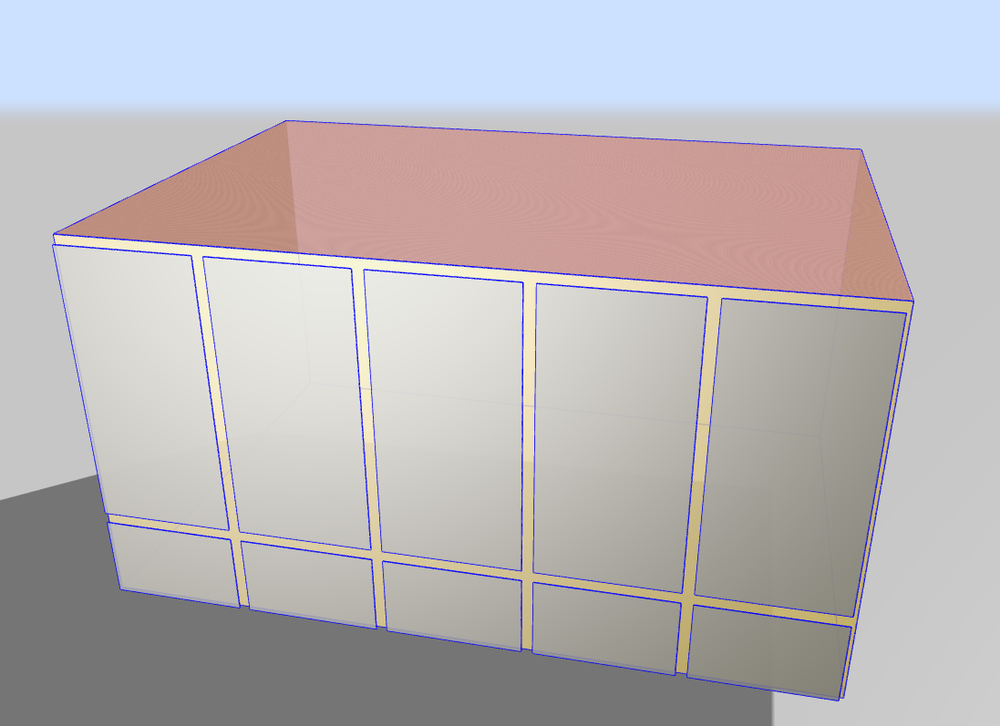

# EnergyPlus Scraper for COMFEN Simulations

Data scraper process:

* Documents necessary energy conversions (summary CSV does this...but not using the summary using the output CSV that has all the reporting data).
* Holds variables for gas and elec pricing.
* Holds variables for source-site factors. 
* Holds variables for CO2e factors. 
* Combines all EnergyPlus default CSV files in defined directory.
* Grabs the wanted columns from the merged dataframe. Renamed columns. Cleaned data if necessary.
* Gets the annual energy data
    * Uses the pricing variable to convert to costs.
    * Combines the annual data and costs into grouped dataframe.
    * Exports annual data to CSV.
*Determines the delta from base case (existing) conditions.
    * Establish dataframes for each condition.
    * Merges these dfs.
    * Performs delta calculations and adds columns to df.
    * Exports grouped df to CSV.
    * Repeats this for peak demand, but first found the day/hour of the peak performer.

